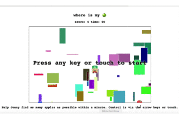

# Where is my apple? - My first game with PyScript

I made my first game with PyScript(https://pyscript.net). 

Thanks Kenney https://kenney.nl for the assets

Thanks to gkvoelkl (https://github.com/gkvoelkl/elm-johnny) who created this game first in Elm.

You can play it on https://gkvoelkl.itch.io/johnny-where-is-my

<br><br><br><br><br><br><br><br><br><br><br><br><br><br>


```Rust

```
